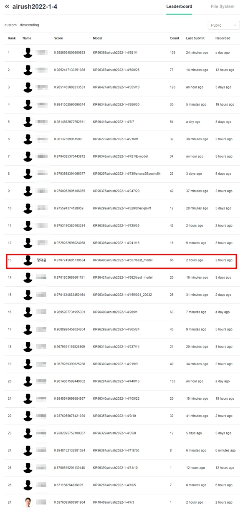

# 네이버 AIRUSH 2022 1라운드

2021년 7월 5일 ~ 2021년 7월 27일동안 진행한 대회입니다. 26명중 13위로 마무리했습니다.

중간에 장염이 걸려서 일주일 정도 진행하지 못했으나, 다행히 예선 통과 순위까지 도달할 수 있었습니다.

1-4 랜드마크 분류 과제를 수행했으며, pytorch를 사용했습니다.

모델 사이즈에 FLOPS 제한이 있었기 때문에, 최대한 많은 모델들을 테스트 해본 이후, 데이터를 albumentations 라이브러리를 사용해 증강하고, 모델 앙상블로 점수를 향상시켰습니다.

아쉽게도 네이버 내부 보안때문에 코드 업로드는 못했습니다.

# 네이버 Airush 2022 2라운드

현재 진행중입니다.
