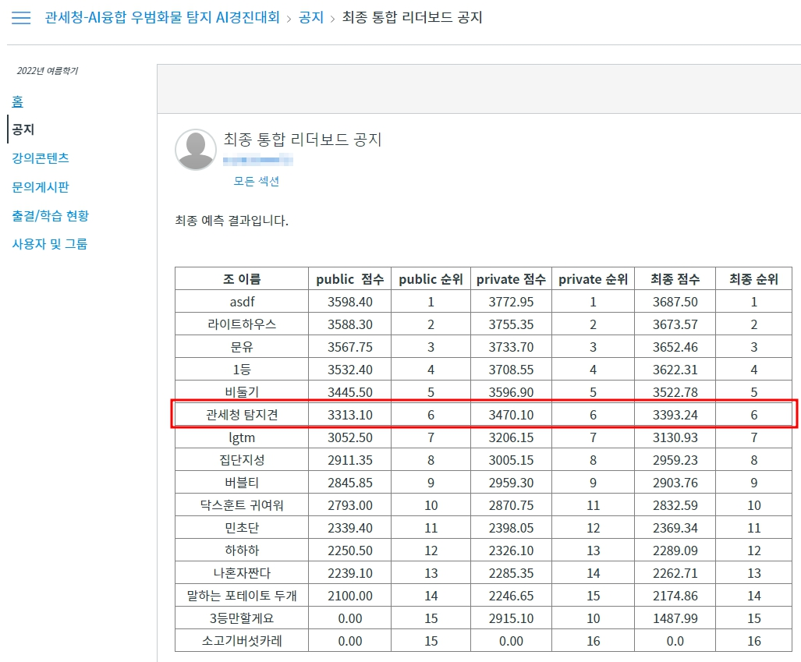

# AI융합학부 우범화물 탐지 경진대회

2022년 7월 25일 ~ 2022년 8월 4일까지 진행한 대회입니다. 

총 6위로 순위를 마무리했습니다.

아쉽게도 시간을 많이 쏟지 못해서 좋은 성적을 거두지 못했습니다.

## 파일 구성

- detect_freight_final.ipynb [Catboost 모델로 각각 우범/핵심을 예측해 앙상블한 코드](./detect_freight_final.ipynb)